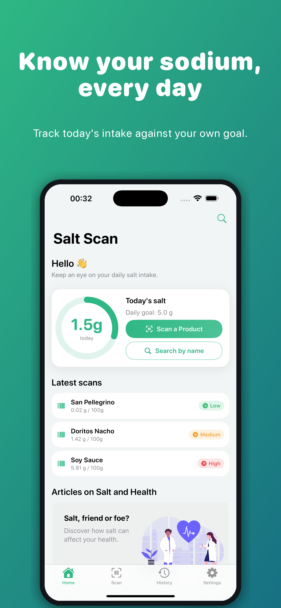
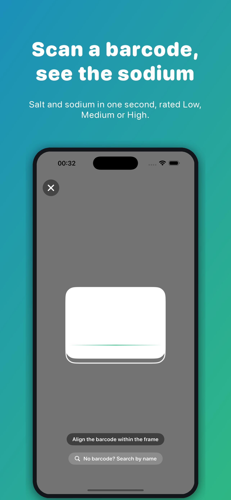
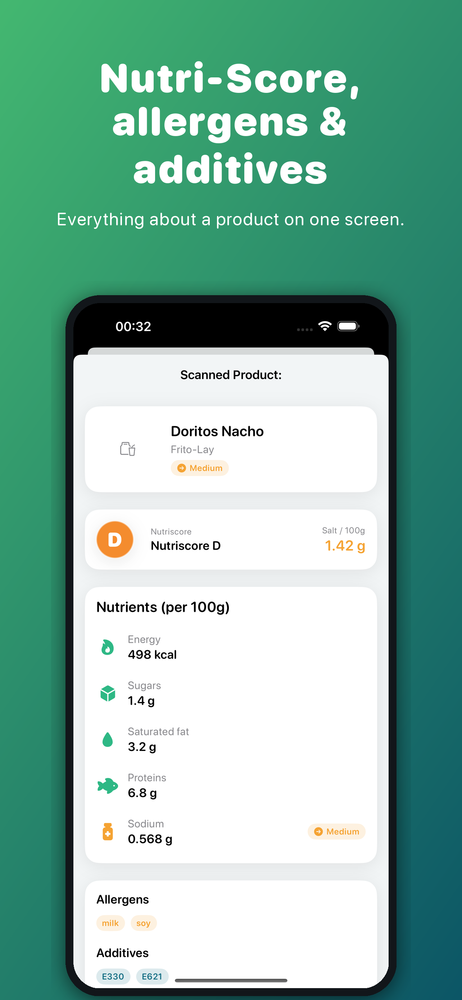

# SaltScan

Native iOS app (SwiftUI) that scans food product barcodes and surfaces salt & nutrition information, helping users stay below the WHO 5 g/day salt limit.

<p align="center">
  
  
  
</p>

## Features

- **Barcode scanner** — instant lookup via OpenFoodFacts, with Firebase Firestore fallback. Salt rating follows the UK traffic-light thresholds (≤ 0.3 g low, ≤ 1.5 g medium, above high, per 100 g).
- **Rich product detail** — Nutriscore, energy, sugars, saturated fat, salt, proteins, allergens, additives, ingredients, product image. When a barcode is unknown, the app offers search by name or adding the product to Open Food Facts.
- **Daily salt journal** — log servings, track today's intake against a configurable goal (default 5 g, WHO).
- **Scan history & favorites** — SwiftData-backed, searchable, swipe actions.
- **Product search by name** (Home toolbar, scanner, not-found screen) and **side-by-side comparison** (History › Compare, 2 to 4 products).
- **App Store rating prompt** after the third successful scan or first journal entry, once per version (`ReviewGate`).
- **Ad consent** through Google UMP before AdMob starts (`AdsConsentManager`); a privacy-options entry appears in Settings where required.
- **Share** product summaries.
- **i18n** — English, French, Arabic (full RTL).
- **Light / Dark / System** appearance + iOS 18 tinted app icon.

## Tech stack

- SwiftUI + Swift Concurrency, MVVM
- SwiftData (iOS 18+) for persistence
- AVFoundation for barcode capture
- Firebase (Firestore fallback) + Google Mobile Ads
- iOS 18.0 minimum deployment target

## Build & run

Open `SaltScan.xcodeproj` in Xcode and run the `SaltScan` scheme.

CLI:

```bash
xcodebuild -project SaltScan.xcodeproj \
  -scheme SaltScan \
  -destination 'platform=iOS Simulator,name=iPhone 15' build
```

## Project layout

```
SaltScan/App/
├── Main/            # SaltScanApp entry, MainView (4-tab root)
├── DesignSystem/    # Theme + reusable SS components
├── Persistence/     # SwiftData models (ScanEntry, DailyIntake, IntakeLine)
├── Screens/         # Onboarding, Home, Scanner, Result, History, Search, Compare, Settings
├── Services/        # APIService (OpenFoodFacts) + FirebaseService fallback
├── Components/      # Shared SwiftUI views
└── Utils/           # Constants, Appearance, ads, helpers
```

## Tooling

- `tools/generate_app_icon.py` — Pillow script that generates the 3 iOS 18 app icon variants (any / dark / tinted).
- `tools/take_screenshots.sh` — drives the iPhone 16 Pro Max simulator to capture 5 raw screens in en/fr/ar (routes: home, scanner, detail, compare, history).
- `tools/composite_screenshots.py` — composites them into 6 App Store slides per store locale (en-US, en-GB, fr-FR, ar-SA) and per display size (6.5" 1284×2778, 6.9" 1320×2868) under `marketing/screenshots/<locale>/<size>/`.
- `marketing/metadata/<locale>/` — App Store Connect name, subtitle, keywords, promotional text, description and release notes per localization, with the submission checklist in `marketing/metadata/README.md`.

## License

© 2025 Achraf Trabelsi. All rights reserved.
