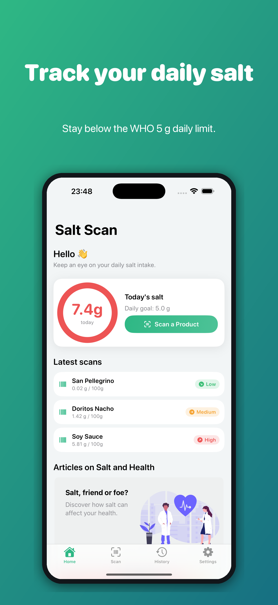
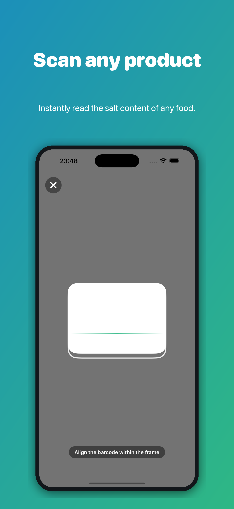
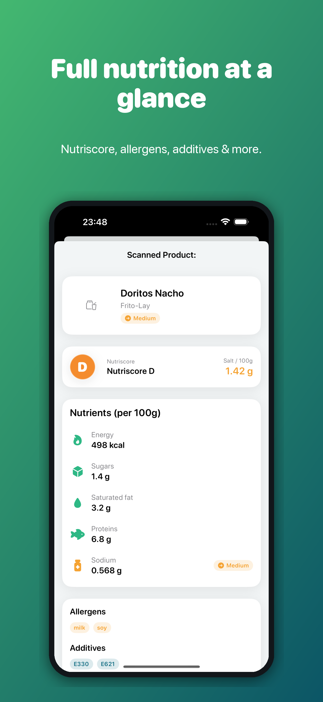

# SaltScan

Native iOS app (SwiftUI) that scans food product barcodes and surfaces salt & nutrition information, helping users stay below the WHO 5 g/day salt limit.

<p align="center">
  
  
  
</p>

## Features

- **Barcode scanner** — instant lookup via OpenFoodFacts, with Firebase Firestore fallback.
- **Rich product detail** — Nutriscore, energy, sugars, saturated fat, salt, proteins, allergens, additives, ingredients, product image.
- **Daily salt journal** — log servings, track today's intake against a configurable goal (default 5 g, WHO).
- **Scan history & favorites** — SwiftData-backed, searchable, swipe actions.
- **Product search by name** and **side-by-side comparison**.
- **Share** product summaries.
- **i18n** — English, French, Arabic (full RTL).
- **Light / Dark / System** appearance + iOS 18 tinted app icon.

## Tech stack

- SwiftUI + Swift Concurrency, MVVM
- SwiftData (iOS 18+) for persistence
- AVFoundation for barcode capture
- Firebase (Firestore fallback) + Google Mobile Ads
- iOS 18.0 minimum deployment target

## Build & run

Open `SaltScan.xcodeproj` in Xcode and run the `SaltScan` scheme.

CLI:

```bash
xcodebuild -project SaltScan.xcodeproj \
  -scheme SaltScan \
  -destination 'platform=iOS Simulator,name=iPhone 15' build
```

## Project layout

```
SaltScan/App/
├── Main/            # SaltScanApp entry, MainView (4-tab root)
├── DesignSystem/    # Theme + reusable SS components
├── Persistence/     # SwiftData models (ScanEntry, DailyIntake, IntakeLine)
├── Screens/         # Onboarding, Home, Scanner, Result, History, Search, Compare, Settings
├── Services/        # APIService (OpenFoodFacts) + FirebaseService fallback
├── Components/      # Shared SwiftUI views
└── Utils/           # Constants, Appearance, ads, helpers
```

## Tooling

- `tools/generate_app_icon.py` — Pillow script that generates the 3 iOS 18 app icon variants (any / dark / tinted).
- `tools/take_screenshots.sh` — drives the iPhone 16 Pro Max simulator to capture marketing screenshots in en/fr/ar.
- `tools/composite_screenshots.py` — composites the raw captures into the final 1284×2778 App Store slides with marketing taglines.

## License

© 2025 Achraf Trabelsi. All rights reserved.
